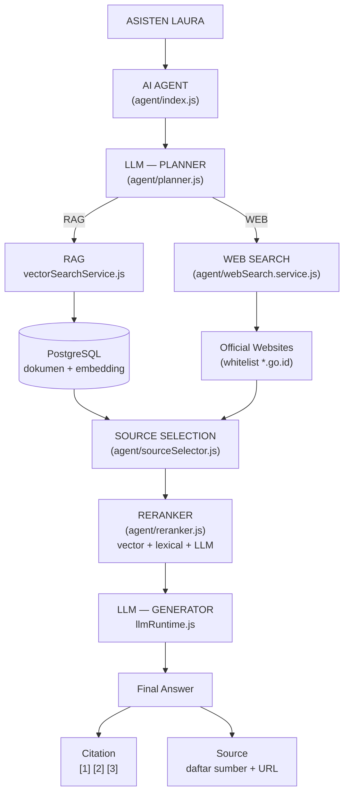

# Pipeline AI Agent LAURA

Dokumen ini menjelaskan struktur runtime yang diimplementasikan di
`backend/src/services/ai/agent/`.

## Alur



Teks (tanpa Mermaid):

```
                         ASISTEN LAURA
                               │
                               ▼
                         ┌────────────┐
                         │ AI AGENT   │
                         └─────┬──────┘
                               │
                              LLM            (planner: routing + query rewrite)
                               │
              ┌────────────────┼────────────────┐
              │                                 │
              ▼                                 ▼
             RAG                           WEB SEARCH
              │                                 │
              ▼                                 ▼
     PostgreSQL + embedding              Official Websites
              │                                 │
              └──────────────┬──────────────────┘
                             ▼
                      Source Selection
                             │
                             ▼
                          Reranker
                             │
                             ▼
                            LLM
                             │
                             ▼
                       Final Answer
                             │
                      ┌──────┴──────┐
                      ▼             ▼
                   Citation       Source
```

## Peta modul

| Tahap | File | Tanggung jawab |
| --- | --- | --- |
| AI Agent (orkestrasi) | `ai/agent/index.js` | Menjalankan seluruh tahap, menyusun trace, fallback tiap tahap |
| Planner | `ai/agent/planner.js` | Menentukan `useRag` / `useWeb` + query pencarian (LLM, fallback heuristik) |
| RAG | `services/vectorSearchService.js` | Embedding pertanyaan → cari chunk dokumen |
| Web Search | `ai/agent/webSearch.service.js` | Cari di situs resmi (tavily/brave/serpapi/duckduckgo/internal) + unduh konten; query dibatasi `site:` ke domain lingkup |
| Kebijakan/lingkup sumber | `ai/agent/officialSources.js` | Daftar domain yang BOLEH dicari + halaman indeks |
| Source Selection | `ai/agent/sourceSelector.js` | Dedupe, kebijakan sumber, batas keragaman, penomoran sitasi |
| Reranker | `ai/agent/reranker.js` | Skor ulang: vector + lexical (BM25-lite) + relevansi LLM |
| Prompt | `ai/agent/prompts.js` | Persona LAURA, aturan sitasi, blok sumber bernomor |
| Citation | `ai/agent/citations.js` | Validasi `[n]`, daftar sitasi, daftar "Sumber:" |
| LLM runtime | `ai/llmRuntime.js` | Provider-agnostic: `complete`, `completeJson`, `streamCompletion`, fallback |
| Konfigurasi | `ai/agent/config.js` | Semua knob dari environment |

## Kontrak event streaming (SSE)

`askStream()` mengirim event berikut (controller meneruskannya apa adanya):

| Event | Kapan | Isi |
| --- | --- | --- |
| `plan` | setelah perencanaan | `route`, `queries`, `reason` |
| `sources` | sebelum jawaban dihasilkan | daftar sumber terpilih (`ref`, `origin`, `title`, `url`, `page`, `score`) |
| `token` | selama jawaban | `text` |
| `citations` | setelah jawaban selesai | daftar sitasi + flag `used` |
| `done` | akhir | `model`, `provider`, `citations`, `session_id` |

Respons non-streaming (`POST /api/chat`, `/api/public/chat`) menambahkan
`citations` dan `route` pada `data`.

## Konfigurasi (environment)

| Variabel | Default | Keterangan |
| --- | --- | --- |
| `AGENT_ENABLED` | `true` | `false` → kembali ke pipeline RAG legacy |
| `AGENT_PLANNER_ENABLED` | `true` | Matikan untuk melewati LLM planner (heuristik saja) |
| `AGENT_RERANK_ENABLED` | `true` | `false` → urutkan berdasar skor vector saja |
| `AGENT_RERANK_LLM` | `true` | `false` → reranker hybrid lexical+vector (lebih cepat/murah) |
| `AGENT_TOP_K` | `5` | Jumlah sumber final (dipakai juga sebagai jumlah sitasi) |
| `AGENT_MIN_TOP_SCORE` | `0.35` | Skor rerank minimum agar sumber dianggap layak dipakai |
| `AGENT_ESCALATE_ON_WEAK` | `true` | Naik ke web search otomatis bila sumber RAG lemah |
| `AGENT_RAG_CANDIDATES` | `12` | Kandidat chunk sebelum selection/rerank |
| `AGENT_W_VECTOR` / `AGENT_W_LEXICAL` / `AGENT_W_LLM` | `0.35` / `0.25` / `0.4` | Bobot reranker |
| `CITATION_ENABLED` | `true` | Aktifkan sitasi bernomor |
| `CITATION_APPEND_LIST` | `true` | Tambahkan daftar "Sumber:" bila LLM lupa menulis sitasi |
| `AGENT_WEB_SEARCH_ENABLED` | `true` | Cabang web |
| `WEB_SEARCH_PROVIDER` | `auto` | `auto`\|`tavily`\|`brave`\|`serpapi`\|`duckduckgo`\|`internal`\|`off` |
| `WEB_SEARCH_FALLBACK_INTERNAL` | `true` | Bila penyedia memblokir/mengosongkan hasil → otomatis crawl halaman indeks resmi |
| `WEB_SEARCH_OFFICIAL_ONLY` | `true` | Hanya domain di dalam lingkup yang dipakai (lihat bagian Lingkup Pencarian) |
| `WEB_SEARCH_FETCH_TOP` | `3` | Jumlah halaman teratas yang kontennya diunduh |
| `TAVILY_API_KEY` / `BRAVE_SEARCH_API_KEY` / `SERPAPI_API_KEY` | – | Opsional; bila kosong dipakai DuckDuckGo |
| `WEB_SEARCH_ALLOWED_DOMAINS` | – | Tambahan domain yang boleh dicari (pisahkan koma); biasanya tidak perlu karena bisa dari menu Sumber |
| `WEB_SEARCH_ALLOW_GOID_SUFFIX` | `false` | `true` = izinkan SEMUA `*.go.id` (mis. `peraturan.bpk.go.id`) |
| `WEB_SEARCH_ALLOWED_SUFFIXES` | – | Suffix domain tambahan, mis. `.gov,.or.id` |
| `WEB_SEARCH_INDEX_URLS` | – | Halaman indeks tambahan untuk mode `internal` (domainnya otomatis masuk lingkup) |

## Lingkup pencarian web (domain yang boleh dicari)

Lingkup diatur di **backend** (`agent/officialSources.js`) dan dapat diubah dari
**Admin Console → Sumber** (`frontend/src/app/admin/sumber/page.jsx`) — tepat di
tempat link diinput — tanpa edit `.env` dan **tanpa restart**. Frontend chat
sendiri hanya menampilkan `sources` yang dikirim API.

**Ruang lingkup = link yang diinput.** Domain diturunkan otomatis dari kolom URL
tabel `sources` (boleh ditulis `https://www.pom.go.id` maupun `palangkaraya.pom.go.id`).
Setiap kali sumber ditambah/diubah/dihapus, cache lingkup disegarkan
(`source.controller.js` → `webSearchConfigService.refresh()`).

Susunan lingkup yang berlaku:

```
1. domain dari daftar Sumber (tabel `sources`)      <- link yang diinput admin
2. domain tambahan dari dashboard (tabel `settings`)
3. WEB_SEARCH_ALLOWED_DOMAINS (.env)
4. bawaan sistem: pom.go.id, bpom.go.id, bbpom.go.id,
   cekbpom.pom.go.id, bbpompky.id   <- dilewati bila "Hanya pakai daftar ini" ON
5. domain halaman indeks (WEB_SEARCH_INDEX_URLS)
```

### Lewat dashboard (disarankan)

Di halaman **Sumber**: masukkan link-nya di form kiri (Nama + URL), lalu pada
kartu **Ruang lingkup pencarian web** di bawahnya nyalakan opsi yang diinginkan:

| Opsi dashboard | Efek |
| --- | --- |
| Pakai link dari daftar Sumber | domain dari tabel `sources` masuk lingkup (setting `web_search_use_sources`, default ON) |
| Hanya pakai daftar ini (abaikan bawaan sistem) | domain bawaan & `.env` diabaikan (`web_search_strict_scope`) |
| Batasi hasil ke domain dalam lingkup | sama dengan `WEB_SEARCH_OFFICIAL_ONLY` |
| Izinkan semua situs pemerintah (`*.go.id`) | sama dengan `WEB_SEARCH_ALLOW_GOID_SUFFIX=true` |

Tersedia juga **Uji link** untuk memeriksa apakah sebuah URL termasuk lingkup,
serta daftar "Domain yang BENAR-BENAR dipakai saat ini" sebagai bukti lingkup aktif.

Endpoint (khusus admin):

| Endpoint | Kegunaan |
| --- | --- |
| `GET /api/admin/web-search-config` | Lingkup yang berlaku + asal nilai (`dashboard`/`env`) |
| `POST /api/admin/web-search-config` | Simpan `domains[]`, `indexUrls[]`, `useSources`, `allowGovSuffix`, `officialOnly`, `strictScope`, atau `reset: true` |
| `POST /api/admin/web-search-config/check` | Uji satu URL (`{ url }`) |

Nilai disimpan di tabel `settings` (kunci `web_search_*`) dan di-cache di memori;
perubahan langsung dipakai pada chat berikutnya.

### Lewat .env (bila belum diatur dari dashboard)

| Kebutuhan | Setelan |
| --- | --- |
| Tambah situs resmi lain (mis. Kemenkes) | `WEB_SEARCH_ALLOWED_DOMAINS=kemenkes.go.id,halal.go.id` |
| Izinkan seluruh situs pemerintah | `WEB_SEARCH_ALLOW_GOID_SUFFIX=true` (termasuk `bpk.go.id`) |
| Batasi ke satu situs saja | `WEB_SEARCH_ALLOWED_DOMAINS=` (biarkan kosong) dan jangan set `WEB_SEARCH_INDEX_URLS` |
| Matikan cabang web | `AGENT_WEB_SEARCH_ENABLED=false` atau `WEB_SEARCH_PROVIDER=off` |

Dua lapis penjagaan:

1. **Query dibatasi** — mesin pencari ditanya dengan `site:pom.go.id` /
   `site:bbpompky.id` (`buildScopedQueries()`), Tavily memakai `include_domains`.
2. **Hasil difilter** — setiap URL hasil dicek `isOfficialUrl()`; yang di luar
   lingkup dibuang dan domain-nya dicatat di `agent.trace` / `route.webNotes`
   (contoh catatan: `di luar lingkup (dibuang): bpk.go.id`).

## Routing & kualitas sumber (anti "salah sumber")

Dua penjagaan agar LAURA tidak menjawab dari dokumen yang tidak relevan:

1. **Pertanyaan cek produk / nomor registrasi wajib lewat web.**
   Pola nomor izin edar seperti `GKL1713713144A1` atau `MD 1234567890123`, kata
   kunci "cek produk/obat/kosmetik", "nomor registrasi", "NIE" → planner memaksa
   `use_web = true` (sebelumnya hanya RAG, sehingga dijawab dari dokumen tak terkait).
2. **Sumber lemah memicu eskalasi dan tidak dipaksakan.**
   Sumber dianggap lemah bila skor rerank terbaik < `AGENT_MIN_TOP_SCORE` **atau**
   semua sumber dinilai 0 oleh reranker LLM (mis. dokumen "Biaya PNBP" untuk
   pertanyaan nomor registrasi obat).
   - Agent langsung mencari ke web lalu menggabungkan kandidat dan rerank ulang.
   - Bila tetap lemah: LLM diberi catatan agar **tidak memaksakan jawaban** dan
     mengarahkan pengguna ke tautan resmi (`cekbpom.pom.go.id`, BPOM Mobile, kanal BBPOM).
   - Daftar "Sumber:" tidak ditempelkan dan sumber ditandai `weak: true`
     (UI chat menampilkan badge "relevansi rendah").

### Batas kemampuan: cek NIE spesifik
Halaman `cekbpom.pom.go.id` adalah aplikasi **dinamis**: daftar produk diambil dari
endpoint DataTables (`window.dataTableUrl = /produk-dt/...`) yang mensyaratkan
cookie sesi + CSRF token, sehingga **tidak terbaca lewat scraping halaman**, dan
nomor NIE tidak pernah terindeks mesin pencari. Untuk nomor NIE spesifik, LAURA
kini: (a) menjawab jujur bahwa datanya belum tersedia, (b) mengarahkan ke
tautan/aplikasi resmi. Agar nomor NIE benar-benar terjawab, diperlukan
**integrasi endpoint Cek Produk** (lihat `src/scripts/diagCekBpom*.js` untuk
temuan teknisnya).

## Perilaku fallback (penting)

| Kondisi | Yang terjadi |
| --- | --- |
| LLM planner gagal / nonaktif | Dipakai aturan heuristik (`planner.heuristicPlan`) |
| RAG tidak menemukan chunk | Otomatis mencoba web search (eskalasi adaptif) |
| Web search gagal / tanpa jaringan | Cabang web kosong + catatan pada `trace`; jawaban tetap dari RAG |
| Reranker LLM gagal | Bobot dinormalisasi ulang ke sinyal vector+lexical |
| LLM generator gagal/nonaktif | Teks fallback memakai chunk terbaik (perilaku sama seperti pipeline lama) |
| Semua sumber kosong | LLM diminta menjawab jujur bahwa informasi belum tersedia |

## Uji

```bash
cd backend
node src/scripts/testAgentPipeline.js   # uji offline: planner, selection, reranker, sitasi
```

Uji ini tidak memerlukan DB maupun internet.
